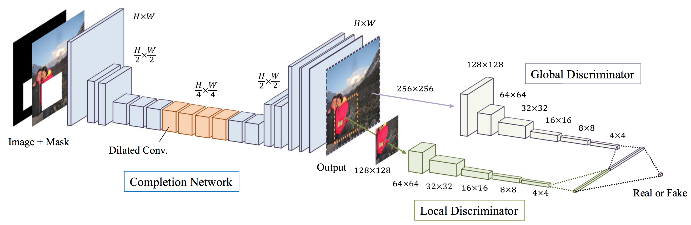

# GLCIC
## Globally and Locally Consistent Image Completion

### Architechture:


---
### Dependencies Required:
- Python 3.6
- Keras
- Numpy
- Tensorflow
- OpenCV
---

## Dataset:
### Places Dataset

```
wget http://data.csail.mit.edu/places/places365/test_256.tar
wget http://data.csail.mit.edu/places/places365/val_256.tar
unzip test_256.tar
unzip val_256.tar
```


> Author : P. Sai Vinay

